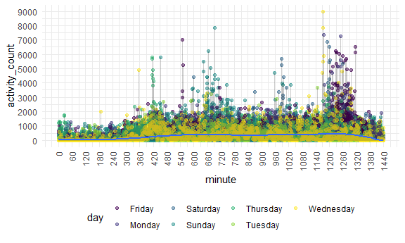
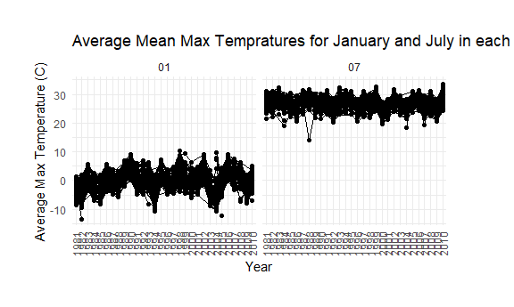

Homework 3
================
Daniel Ojeranti
10/7/2020

### Problem 1

The “instacart” dataset contains 1384617 rows and 15 columns.

Observations are the level of items in orders by user. There are user /
order variables – user ID, order ID, order day, and order hour. There
are also item variables – name, aisle, department, and some numeric
codes.

    ## # A tibble: 134 x 2
    ##    aisle                              n
    ##    <chr>                          <int>
    ##  1 fresh vegetables              150609
    ##  2 fresh fruits                  150473
    ##  3 packaged vegetables fruits     78493
    ##  4 yogurt                         55240
    ##  5 packaged cheese                41699
    ##  6 water seltzer sparkling water  36617
    ##  7 milk                           32644
    ##  8 chips pretzels                 31269
    ##  9 soy lactosefree                26240
    ## 10 bread                          23635
    ## # ... with 124 more rows

There are a total of134 aisles, and the most ordered items are fresh
vegetables.

**A scatterplot showing the number of items ordered in each aisle.**

**This table shows us the three most popular items in each aisle.**

| aisle                      | product\_name                                 |    n | rank |
| :------------------------- | :-------------------------------------------- | ---: | ---: |
| baking ingredients         | Light Brown Sugar                             |  499 |    1 |
| baking ingredients         | Pure Baking Soda                              |  387 |    2 |
| baking ingredients         | Cane Sugar                                    |  336 |    3 |
| dog food care              | Snack Sticks Chicken & Rice Recipe Dog Treats |   30 |    1 |
| dog food care              | Organix Chicken & Brown Rice Recipe           |   28 |    2 |
| dog food care              | Small Dog Biscuits                            |   26 |    3 |
| packaged vegetables fruits | Organic Baby Spinach                          | 9784 |    1 |
| packaged vegetables fruits | Organic Raspberries                           | 5546 |    2 |
| packaged vegetables fruits | Organic Blueberries                           | 4966 |    3 |

**In this table, we see the mean hour of day where “Pink Lady Apples”
and “coffee Ice Cream” are ordered each day of the week.**

| product\_name    |        0 |        1 |        2 |        3 |        4 |        5 |        6 |
| :--------------- | -------: | -------: | -------: | -------: | -------: | -------: | -------: |
| Coffee Ice Cream | 13.77419 | 14.31579 | 15.38095 | 15.31818 | 15.21739 | 12.26316 | 13.83333 |
| Pink Lady Apples | 13.44118 | 11.36000 | 11.70213 | 14.25000 | 11.55172 | 12.78431 | 11.93750 |

## Problem 2

The “accel” dataset contains 50400 rows and 6 columns.

Observations are five weeks of accelerometer data collected on a 63
year-old male. The observations include the week, day, day\_id
representing the day as a numeric value, minute of the day, activity
count, and weekend vs. weekday variable.

| day       | week | total\_activity |
| :-------- | ---: | --------------: |
| Monday    |    1 |        78828.07 |
| Tuesday   |    1 |       307094.24 |
| Wednesday |    1 |       340115.01 |
| Thursday  |    1 |       355923.64 |
| Friday    |    1 |       480542.62 |
| Saturday  |    1 |       376254.00 |
| Sunday    |    1 |       631105.00 |
| Monday    |    2 |       295431.00 |
| Tuesday   |    2 |       423245.00 |
| Wednesday |    2 |       440962.00 |
| Thursday  |    2 |       474048.00 |
| Friday    |    2 |       568839.00 |
| Saturday  |    2 |       607175.00 |
| Sunday    |    2 |       422018.00 |
| Monday    |    3 |       685910.00 |
| Tuesday   |    3 |       381507.00 |
| Wednesday |    3 |       468869.00 |
| Thursday  |    3 |       371230.00 |
| Friday    |    3 |       467420.00 |
| Saturday  |    3 |       382928.00 |
| Sunday    |    3 |       467052.00 |
| Monday    |    4 |       409450.00 |
| Tuesday   |    4 |       319568.00 |
| Wednesday |    4 |       434460.00 |
| Thursday  |    4 |       340291.00 |
| Friday    |    4 |       154049.00 |
| Saturday  |    4 |         1440.00 |
| Sunday    |    4 |       260617.00 |
| Monday    |    5 |       389080.00 |
| Tuesday   |    5 |       367824.00 |
| Wednesday |    5 |       445366.00 |
| Thursday  |    5 |       549658.00 |
| Friday    |    5 |       620860.00 |
| Saturday  |    5 |         1440.00 |
| Sunday    |    5 |       138421.00 |

In weeks 1, 2, and 5 there seems to be a general increase in activity
throughout the week. On week 3, the total activity seems constant
throughout the days and on week 4 it seemed to decrease throughout the
week. In the last 2 weeks, the patient recorded its lowest times in
activity for Saturday and Sunday.

**Accelerometer data of 24 hour activity per day**

There seems to be a general increase in activity starting from minute
360 (6am) and it changes throughout the day. The patients activity seems
to be constant throughout the day and tends to decrease from 1260th
minute of the day (9pm).

## Problem 3

The NOAA dataset contains 2595176 rows and 7 columns and there are
3387623 missing values.

This dataset comes from the NOAA which provides public access to weather
data. Observations include the weather station ID, date, precipitation
in millimeters, snowfall in millimeters, snow depth in millimeters,
maximum temperatures and minimum temperatures, both in Celsius.

    ## # A tibble: 1 x 3
    ##    snow       n  rank
    ##   <int>   <int> <int>
    ## 1     0 2008508     1

The most commonly observed value of snowfall is 0. This is probably
because there are more days where there isn’t snow compared to the
amount of day where there is snow. Also, snow levels are partitioned by
millimeters so it makes sense that there are more days with no snowfall
then days with any depth of snow.

In this plot it seems that the the average max temperatures in July are
higher generally when compared to January. This makes sense because July
is in the summer and January is in the winter. We expect there to be
higher temperatures during the summer. THere are a couple of outliers as
well. In the January of year 1982, there was a max average temp of below
-10 degrees celsius. Also in the July of year 1998 there was a max
average temp of about 15 degrees celsius which isn’t typical.

**Hexplot of Maximum Temperature by Minimum Temperature and Plot of
Snowfall by Year.**

In the first plot we observe a hexplot of maximum temperature by minimum
temperature. The more frequent observartion are towards the inner
diagonal of the data where counts reach upwards to 5000. In the second
plot we observe a violin distribution of snowfall ranging from 0 to 100
millimeters by year. As we can see throughout the years, the
distribution seems to be relatively consistent.
